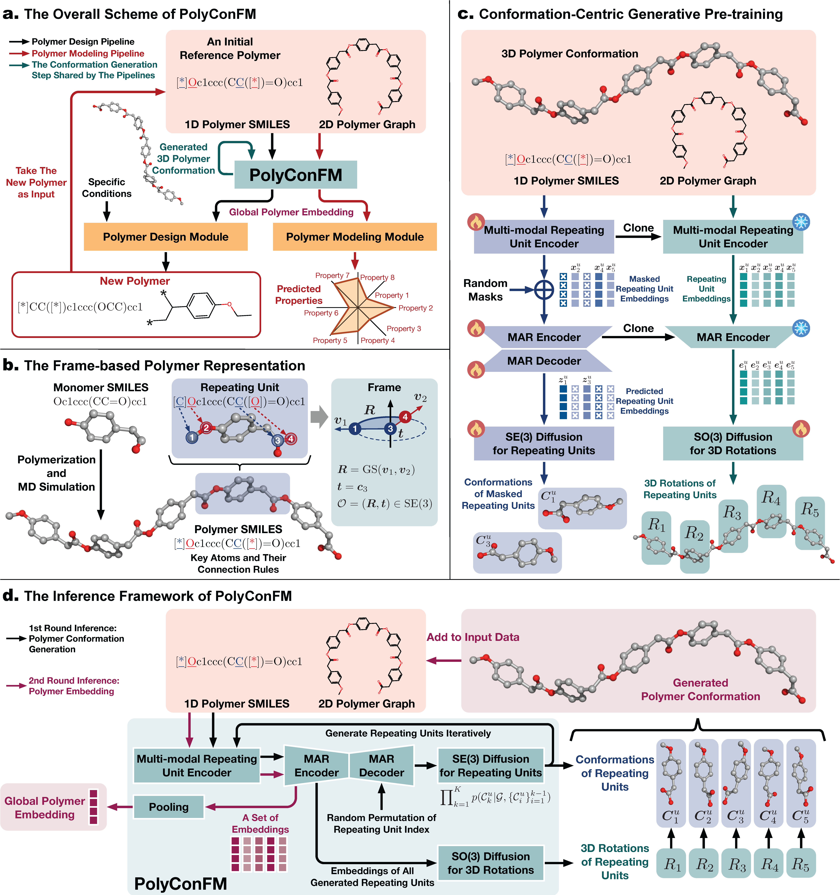

<div align=center>


# Unifying Polymer Modeling and Design via a Conformation-Centric Generative Foundation Model

[](https://arxiv.org/abs/2510.16023)
[](https://zenodo.org/records/17577742)
[](LICENSE)

</div>


## 📖 Overview
**PolyConFM** is the first polymer foundation model that unifies polymer modeling and design through conformation-centric generative pretraining. In particular, PolyConFM achieves state-of-the-art performance on three fundamental tasks: 
  
1.  **Polymer Conformation Generation**: Predict the stable 3D structures of polymers.
2.  **Polymer Property Prediction**: Forecast key physical and chemical properties.
3.  **Polymer Design**: Generate novel polymers satisfying specific conditions.

By seamlessly bridging polymer structure, properties, and design, PolyConFM serves as a powerful and universal tool for advancing polymer science.  

<p align="center" style="margin-top: 20px;">
  
</p>


## ⚒️ Dependencies
* [Uni-Core](https://github.com/dptech-corp/Uni-Core), please check its [Installation Documentation](https://github.com/dptech-corp/Uni-Core#installation).
* Other dependencies are listed in `requirements.txt`, please execute the following command:
  ```bash
  pip install -r requirements.txt
  pip install git+https://github.com/igor-krawczuk/mini-moses
  ```


## 📦 Datasets
All datasets used in this work are provided on [Zenodo](https://zenodo.org/records/17568899). Please download and organize them into the `./datasets` directory as follows:
```
PolyConFM
├──datasets
│   ├── pretrain_dataset
│   ├── property_dataset
│   ├── design_dataset
│
```


## 🚀 Quick Inference
All model weights are available on [Zenodo](https://zenodo.org/records/17577742). Please download and organize them into the `./ckpts` directory as follows:
```
PolyConFM
├──ckpts
│   ├── pretrain_ckpt
│   ├── property_ckpt
│   ├── design_ckpt
│
```
Then you can easily run inference for three fundamental tasks using the following scripts:

### 1. Polymer Conformation Generation
```bash
bash ./scripts/conf_script/conf_gen.sh
python ./scripts/conf_script/conf_eval.py
```

### 2. Polymer Property Prediction
```bash
bash ./scripts/property_script/property_inference.sh
python ./scripts/property_script/property_eval.py
```

### 3. Polymer Design
```bash
bash ./scripts/design_script/design_inference.sh
python ./scripts/design_script/design_eval.py
```


## 💪 Train from Scratch
You can also train PolyConFM from scratch using the following scripts:

### 1. Conformation-Centric Pretraining
This is the core training process that enables all downstream tasks.
```bash
bash ./scripts/pretrain.sh
```
*Note: The conformation generation capability is unlocked directly after pretraining and does not require a separate finetuning step.*

### 2. Finetuning for the Downstream Polymer Property Prediction Task
```bash
bash ./scripts/property_script/property_train.sh
```

### 3. Finetuning for the Downstream Polymer Design Task
```bash
bash ./scripts/design_script/design_train.sh
```


## 👍 Acknowledgments
 We extend our sincere gratitude to [Uni-Core](https://github.com/dptech-corp/Uni-Core), [Uni-Mol](https://github.com/dptech-corp/Uni-Mol), [MolCLR](https://github.com/yuyangw/MolCLR), [MAR](https://github.com/LTH14/mar), [TorsionalDiff](https://github.com/gcorso/torsional-diffusion), [FrameDiff](https://github.com/jasonkyuyim/se3_diffusion), [GraphDiT](https://github.com/liugangcode/Graph-DiT) for their great work and codebase, which served as the foundation for developing PolyConFM.


## 📌 Citation
If you find PolyConFM useful in your research, please consider citing our paper. 😊
```bibtex
@article{wang2025unifying,
  title={Unifying Polymer Modeling and Design via a Conformation-Centric Generative Foundation Model},
  author={Wang, Fanmeng and Mei, Shan and Guo, Wentao and Wang, Hongshuai and Ou, Qi and Gao, Zhifeng and Xu, Hongteng},
  journal={arXiv preprint arXiv:2510.16023},
  year={2025}
}
```